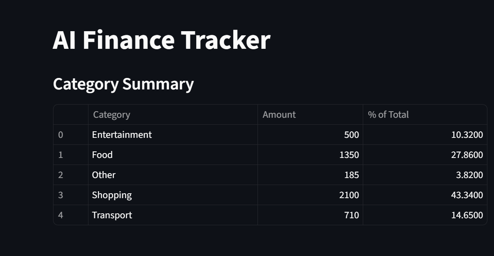

---

````markdown
# AI Finance Tracker 💰


---

## Project Description

**AI Finance Tracker** is a Streamlit app designed to help users manage and understand their personal finances. 
It allows you to track transactions, visualize spending patterns, and receive AI-driven insights on your expenses. 
The app automatically categorizes transactions, generates interactive charts, and provides month-over-month spending trends.

This project was built with a focus on clean code, user-friendly interface, and actionable financial insights.

---

## Features

- Load and view transactions from a CSV file.
- Filter transactions by category or view all transactions.
- Interactive visualizations:
  - Pie chart of overall spending by category.
  - Bar chart showing top 5 spending categories.
  - Line chart showing monthly spending trends.
- Auto-categorization of transactions using keyword-based logic.
- Month-over-month spending insights for each category.
- Add new transactions with a simple form directly in the app.
- Persistent storage: all changes are saved to the CSV file.
- Fully responsive and easy-to-use Streamlit interface.

---

## Installation

1. **Clone the repository**
```bash
git clone https://github.com/ak4shravikumar/AI_POWERED_FINANCE_TRACKER.git
````

2. **Navigate into the project directory**

```bash
cd AI_POWERED_FINANCE_TRACKER
```

3. **Install dependencies**

```bash
pip install -r requirements.txt
```

> Make sure your `requirements.txt` includes:
>
> ```text
> streamlit
> pandas
> plotly
> ```

---

## Usage

Run the Streamlit app with:

```bash
streamlit run app.py
```

**Steps:**

1. View your transactions in an interactive table.
2. Filter by category or view all transactions.
3. Explore interactive charts for spending patterns.
4. Add new transactions directly in the app.
5. Monitor your spending trends with monthly insights.

---

## Screenshots

### 1. Dashboard Overview


### 2. Pie Chart of Spending


### 3. Top Spending Categories Bar Chart


### 4. Monthly Spending Trend


## Future Enhancements 

AI Finance Tracker is actively evolving to become smarter and more user-friendly. Planned improvements include:

- **Real-time expense tracking via SMS:** Automatically parse UPI or bank SMS notifications and append them to the CSV for live updates.  
- **Bank/UPI integration:** Securely fetch and categorize transactions directly from financial accounts.  
- **AI-powered insights:** Detect unusual spending patterns and provide personalized saving suggestions.  
- **Budget planning and alerts:** Set category-wise budgets and receive notifications when limits are approached or exceeded.  
- **Mobile-friendly interface:** Enhance usability on smartphones and tablets for on-the-go expense tracking.  

*Our goal is to make AI Finance Tracker not just a tool, but a smart companion for managing personal finances efficiently.*


## Contributing

Contributions are welcome!

* Open an issue for bugs or feature requests.
* Submit a pull request for improvements or enhancements.

---

## Author

**Akash Ravikumar**

* GitHub: [ak4shravikumar](https://github.com/ak4shravikumar)
* Email: [your\_email@example.com](mailto:ak4shravikumar@gmail.com)

---

## License

This project is licensed under the MIT License.
See the [LICENSE](LICENSE) file for details.

````


